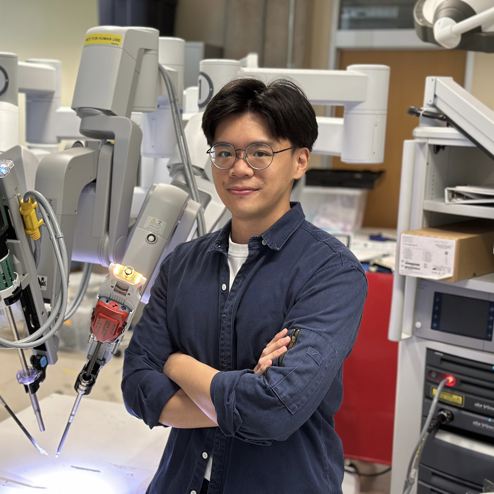
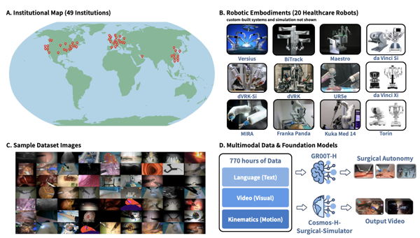
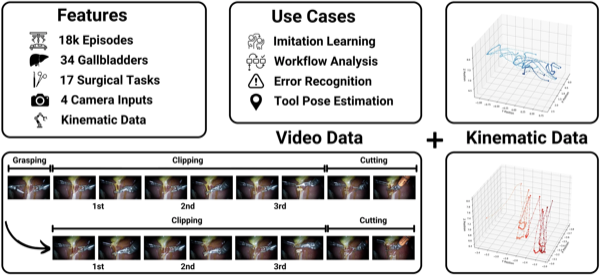
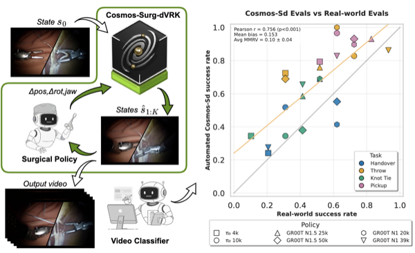
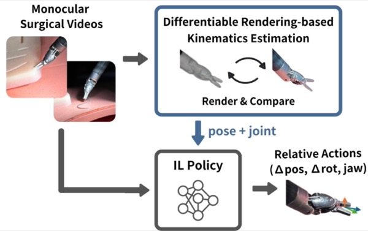
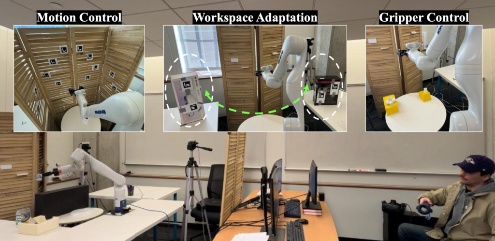
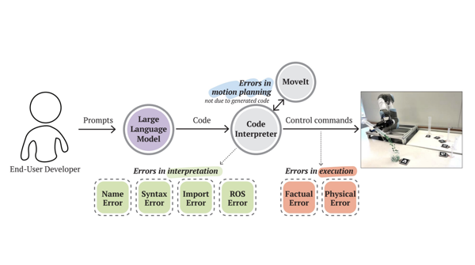
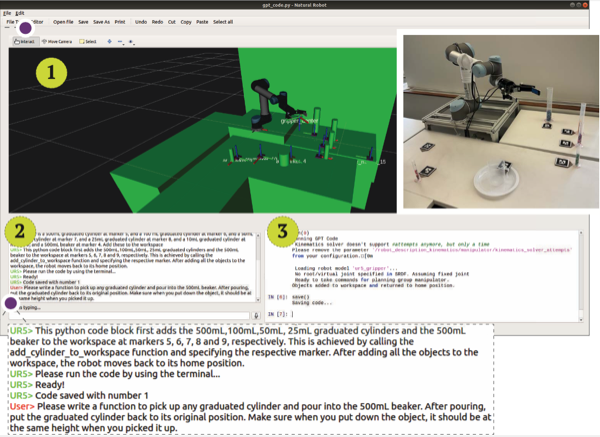

<h1>Juo-Tung (Justin) Chen</h1>

    

        
        <strong style="display: block; margin-top: 14px;">Juo-Tung (Justin) Chen</strong>
         
        <!-- 
            <i class="fa fa-graduation-cap"></i>&nbsp;
            <a href="https://scholar.google.com/citations?hl=en&view_op=list_works&gmla=AH70aAXxk2fHAZPjPFlZOI1pwkNiaeLONfXh8d1Bk3ozfIDCi39IcHQp8BZHilhw_QL-Gnu_nLg_e4Ew6t-VeA&user=qqUqgWoAAAAJ" style="font-size:0.82em; color:var(--muted);">200+ citations &middot; h-index 7</a>
         -->
    

    

        

            I am a PhD Student @
            <a href="https://www.jhu.edu/">Johns Hopkins University</a> in Mechanical Engineering, advised by <a href="https://imerse.lcsr.jhu.edu/"><b>Axel Krieger</b></a> in the <a href="https://imerse.lcsr.jhu.edu/">Intelligent Medical Robotic Systems and Equipment Lab (IMERSE)</a>.
            I am currently interning at <a href="https://www.nvidia.com/"><b>NVIDIA</b></a> (May 2026).
        

        

            I received my Master's degree in Robotics from Johns Hopkins University and my Bachelor's degree in Biomechatronics Engineering from National Taiwan University.
            During my masters, I worked in <a href="https://intuitivecomputing.github.io/">Intuitive Computing Lab</a> advised by <a href="https://www.cs.jhu.edu/~cmhuang/">Chien-Ming Huang</a>, and during my undergrad, I worked in
            <a href="http://rmml.bime.ntu.edu.tw/nturmmle.html">Robots and Medical Mechatronics Lab (RMML)</a> advised by <a href="https://www.bime.ntu.edu.tw/English/News_Photo_Content_n_100917_s_104178.html">Ping-Lang Yen</a>.
        

        <h3><b>Research Interest</b></h3>
        My research sits at the intersection of <b>surgical robotics</b> and <b>robot learning</b>, with a focus on building autonomous surgical systems. I am driven by the following questions:
        <ol>
            <li>How can we train <b>surgical foundation models</b> that generalize across procedures, robot platforms, and institutions by scaling multi-modal data collection?</li>
            <li>How can <b>hierarchical imitation learning</b> enable robots to complete long-horizon surgical tasks that require both high-level reasoning and precise low-level control?</li>
            <li>How can <b>surgical tool pose estimation</b> from monocular video unlock large-scale pretraining data for surgical foundation models — by recovering kinematics from the vast amounts of existing surgical footage that lack robot state recordings?</li>
            <!-- <li>How can we build rigorous <b>benchmarks and evaluation frameworks</b> to measure and drive progress toward fully autonomous surgery?</li> -->
        </ol>
          
        

            &nbsp; <i class="fa fa-file"></i> <a href="https://drive.google.com/file/d/1dqBe-cxOBq6YENV34dAOBzhwg_Q4R5o4/view?usp=sharing">&nbsp; CV</a> &nbsp; |
            &nbsp; <i class="fa fa-linkedin"></i> <a href="https://www.linkedin.com/in/juo-tung-chen/">&nbsp; LinkedIn</a>  &nbsp; |
            &nbsp; <i class="fa fa-github"></i> <a href="https://github.com/JuoTungChen">&nbsp; GitHub</a>  &nbsp; |
            &nbsp; <i class="fa fa-graduation-cap"></i> <a href="https://scholar.google.com/citations?hl=en&view_op=list_works&gmla=AH70aAXxk2fHAZPjPFlZOI1pwkNiaeLONfXh8d1Bk3ozfIDCi39IcHQp8BZHilhw_QL-Gnu_nLg_e4Ew6t-VeA&user=qqUqgWoAAAAJ">Google Scholar</a>  &nbsp; |
            &nbsp; <i class="fa fa-envelope"></i> <a href="mailto:jchen396@jhu.edu">&nbsp; Email</a>
        

    

    <h2>News</h2>
    <ul id="news-list">
        <li class="news-item"><strong>[May, 2026]</strong> &nbsp;Started my internship at <a href="https://www.nvidia.com/">NVIDIA</a> in Santa Clara, CA!</li>
        <li class="news-item"><strong>[Apr, 2026]</strong> &nbsp;Our paper <a href="https://open-h.github.io/open-h-embodiment/">Open-H-Embodiment</a> is on arXiv!</li>
        <li class="news-item"><strong>[Feb, 2026]</strong> &nbsp;Our paper <a href="https://arxiv.org/abs/2510.16240">Cosmos-Surg-dVRK</a> got accepted to RA-L!</li>
        <li class="news-item"><strong>[Jan, 2026]</strong> &nbsp;<a href="https://www.nature.com/articles/s41597-025-06526-z">ImitateCholec</a> dataset paper published in Nature Scientific Data!</li>
        <li class="news-item"><strong>[Sep, 2025]</strong> &nbsp;Our paper <a href="https://suturebot.github.io/">SutureBot</a> was accepted to NeurIPS 2025!</li>
        <li class="news-item news-extra"><strong>[Jul, 2025]</strong> &nbsp;Our paper <a href="https://h-surgical-robot-transformer.github.io/">SRT-H</a> was featured on the cover of Science Robotics!</li>
        <li class="news-item news-extra"><strong>[Jun, 2025]</strong> &nbsp;Our paper <a href="https://ieeexplore.ieee.org/document/11247452">SurgiPose</a> got accepted to IROS 2025!</li>
    </ul>
    <button id="news-toggle" onclick="toggleNews(this)" aria-expanded="false">Show more ▾</button>

    <h2>Publications</h2>
    
* Equal contribution

    

        

            
        

        

            <b>Open-H-Embodiment: A Large-Scale Dataset for Enabling Foundation Models in Medical Robotics</b>  
            Nigel Nelson*, <strong>Juo-Tung Chen*</strong>, Jesse Haworth*, Xinhao Chen*, Lukas Zbinden*, Dianye Huang*, ..., Nassir Navab, Mahdi Azizian, Sean D. Huver, Axel Krieger 
            Preprint 2026
            Featured 
            <a href="https://arxiv.org/abs/2604.21017">Paper</a> &nbsp;|&nbsp;
            <a href="https://open-h.github.io/open-h-embodiment/">Website</a> &nbsp;|&nbsp;
            <a href="https://huggingface.co/datasets/nvidia/PhysicalAI-Robotics-Open-H-Embodiment/tree/main/Surgical">Dataset</a> 
            <button class="abstract-toggle" aria-expanded="false">Abstract ▾</button>
            
We present Open-H-Embodiment, a large-scale multimodal dataset collected from multiple robotic surgical platforms to enable training of foundation models for medical robotics. The dataset spans diverse surgical procedures and provides synchronized video, robot kinematics, and tool state annotations to support the development of generalizable surgical AI systems.

        

    

    

        

            
        

        

            <b>ImitateCholec: A Multimodal Dataset for Long-Horizon Imitation Learning in Robotic Cholecystectomy</b>  
            Pascal Hansen, Ji Woong Brian Kim, Antony Goldenberg, <strong>Juo-Tung Chen</strong>, Yuanzhe Amos Li, Anton Deguet, Brandon White, De Ru Tsai, Richard Cha, Jeffrey Jopling, Paul Maria Scheikl, Axel Krieger 
            Nature Scientific Data 2026 
            <a href="https://www.nature.com/articles/s41597-025-06526-z">Paper</a> &nbsp;|&nbsp;
            <a href="https://archive.data.jhu.edu/dataset.xhtml?persistentId=doi:10.7281/T1PF3FYK">Dataset</a> 
            <button class="abstract-toggle" aria-expanded="false">Abstract ▾</button>
            
ImitateCholec is a multimodal dataset of expert robotic demonstrations for laparoscopic cholecystectomy, designed to support long-horizon imitation learning. It provides synchronized video, robot kinematics, and task annotations spanning full surgical procedures, enabling robots to learn from human surgical expertise at scale.

        

    

    

        

            
        

        

            <b>Cosmos-Surg-dVRK: World Foundation Model-based Automated Online Evaluation of Surgical Robot Policy Learning</b>  
            Lukas Zbinden, Nigel Nelson, <strong>Juo-Tung Chen</strong>, Xinhao Chen, Ji Woong Kim, Mahdi Azizian, Axel Krieger, Sean Huver 
            RA-L 2025 
            <a href="https://arxiv.org/abs/2510.16240">Paper</a> &nbsp;|&nbsp;
            <a href="https://cosmos-surg-dvrk.github.io/">Website</a> 
            <button class="abstract-toggle" aria-expanded="false">Abstract ▾</button>
            
We leverage world foundation models to enable automated online evaluation of surgical robot policies without requiring physical execution. Cosmos-Surg-dVRK generates realistic video rollout predictions that correlate with real-world task performance, enabling efficient policy iteration and reducing the time and cost of surgical robot learning.

        

    

    

        

            
        

        

            <b>SutureBot: A Precision Framework & Benchmark For Autonomous End-to-End Suturing</b>  
            <strong>Juo-Tung Chen*</strong>, Jesse Haworth*, Nigel Nelson, Ji Woong Kim, Masoud Moghani, Chelsea Finn, Axel Krieger 
            NeurIPS 2025
            Featured 
            <a href="https://suturebot.github.io/static/SutureBot_NeurIPS_2025.pdf">Paper</a> &nbsp;|&nbsp;
            <a href="https://suturebot.github.io/">Website</a> &nbsp;|&nbsp;
            <a href="https://huggingface.co/datasets/jchen396/SutureBot">Dataset</a> 
            <button class="abstract-toggle" aria-expanded="false">Abstract ▾</button>
            
We present SutureBot, an end-to-end framework for autonomous robotic suturing that integrates visual perception, motion planning, and force-sensitive control into a unified imitation learning pipeline. We also introduce a comprehensive suturing benchmark with standardized metrics for evaluating performance across diverse tissue types and task configurations.

        

    

    

        

            
        

        

            <b>SRT-H: A Hierarchical Framework for Autonomous Surgery via Language Conditioned Imitation Learning</b>  
            Ji Woong Kim, <strong>Juo-Tung Chen</strong>, Pascal Hansen, Lucy Shi, Antony Goldenberg, Samuel Schmidgall, Paul Scheikl, Anton Deguet, Brandon White, De Ru Tsai, Richard Cha, Jeffrey Jopling, Chelsea Finn, Axel Krieger 
            Science Robotics 2025
            Featured 
            <a href="https://www.science.org/doi/10.1126/scirobotics.adt5254">Paper</a> &nbsp;|&nbsp;
            <a href="https://h-surgical-robot-transformer.github.io/">Website</a> 
            <button class="abstract-toggle" aria-expanded="false">Abstract ▾</button>
            
SRT-H introduces a hierarchical framework for autonomous surgery combining a high-level language-conditioned planner with a low-level visuomotor policy trained via imitation learning. Featured on the cover of <em>Science Robotics</em>, the system successfully executes complex long-horizon surgical tasks by decomposing them into subtask sequences guided by natural language instructions.

        

    

    

        

            
        

        

            <b>SurgiPose: Estimating Surgical Tool Kinematics from Monocular Video for Surgical Robot Learning</b>  
            <strong>Juo-Tung Chen</strong>, XinHao Chen, Ji Woong Kim, Paul Maria Scheikl, Richard Jaepyeong Cha, Axel Krieger 
            IROS 2025 
            <a href="https://ieeexplore.ieee.org/document/11247452">Paper</a> 
            <button class="abstract-toggle" aria-expanded="false">Abstract ▾</button>
            
SurgiPose estimates 6-DoF kinematics of surgical tools from monocular endoscopic video by combining visual feature extraction with robot kinematics priors. This enables recovering tool pose from existing surgical footage that lacks robot state recordings, unlocking large-scale pretraining data for surgical foundation models.

        

    

    

        

            
        

        

            <b>Reducing Performance Variability and Overcoming Limited Spatial Ability: Targeted Training for Remote Robot Teleoperation</b>  
            <strong>Juo-Tung Chen*</strong>, Tsung-Chi Lin*, Chien-Ming Huang 
            IROS 2024 
            <a href="https://ieeexplore.ieee.org/document/10801973">Paper</a> 
            <button class="abstract-toggle" aria-expanded="false">Abstract ▾</button>
            
We investigate how targeted training can reduce performance variability in remote robot teleoperation and help users with limited spatial ability achieve expert-level proficiency. Our study identifies key perceptual and motor skills underlying teleoperation performance and proposes structured training protocols to address individual deficiencies.

        

    

    

        

            
        

        

            <b>Forgetful Large Language Models: Lessons Learned from Using LLMs in Robot Programming</b>  
            <strong>Juo-Tung Chen</strong>, Chien-Ming Huang 
            AAAI Symposium 2023 
            <a href="https://ojs.aaai.org/index.php/AAAI-SS/article/view/27721">Paper</a> &nbsp;|&nbsp;
            <a href="./projects/LLM/Forgetful-Large-Language-Models-Lessons-Learned-from-Using-LLMs-in-Robot-Programming.pdf">Slides</a> 
            <button class="abstract-toggle" aria-expanded="false">Abstract ▾</button>
            
We present lessons learned from deploying large language models for robot programming, focusing on the "forgetfulness" problem where LLMs fail to maintain consistent context across long interaction sequences. Our analysis surfaces practical guidelines for LLM-robot integration and highlights open challenges for the community.

        

    

    

        

            
        

        

            <b>Alchemist: LLM-Aided End-User Development of Robot Applications</b>  
            Ulas Berk Karl, <strong>Juo-Tung Chen</strong>, Victor Nikhil Antony, Chien-Ming Huang 
            HRI 2024 
            <a href="https://dl.acm.org/doi/abs/10.1145/3610977.3634969">Paper</a> &nbsp;|&nbsp;
            <a href="https://sites.google.com/view/llm-alchemist/home">Website</a> 
            <button class="abstract-toggle" aria-expanded="false">Abstract ▾</button>
            
Alchemist is an LLM-powered end-user development platform that enables non-experts to create robot applications through natural language interaction. By abstracting low-level robot APIs into conversational interfaces, Alchemist lowers the barrier to robot programming while maintaining flexibility for complex task specifications.

        

    

